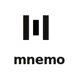

<div align="center">
  <picture>
    <source media="(prefers-color-scheme: dark)" srcset="website/assets/mnemo-lockup-v-dark.svg" />
    <source media="(prefers-color-scheme: light)" srcset="website/assets/mnemo-lockup-v.svg" />
    
  </picture>
  <br /><br />
  <strong>Persistent memory for AI coding agents.</strong>
  <br />
  No more re-explaining your codebase every session.
  <br /><br />

[](https://github.com/arturdonda/mnemo/actions/workflows/ci.yml)
[](https://www.npmjs.com/package/mnemo-cli)
[](LICENSE)

</div>

---

```bash
npm install -g mnemo-cli
```

---

## The problem

You spend an hour with your AI agent. You explain the architecture, scope the relevant files, decide to use Stripe Checkout over Payment Intents, and hit a blocker with webhook validation.

Next session — blank slate. The agent re-reads your directory tree, re-traces your imports, asks what framework you're using. You explain everything again.

**This isn't a token budget problem. It's a memory problem.**

---

## What Mnemo does

Mnemo keeps three indexes of your codebase, updated automatically on every git commit. Your agent reads them at session start and already knows where you left off.

### `mnemo feat context` — the differentiator

Per-feature decisions, linked files, blockers, and status — persisted across sessions:

```
$ mnemo feat context

# FEAT: payment-integration

Branch:       feature/payment-integration
Status:       in-progress
Last updated: 2026-04-25

## Relevant Files
· src/routes/payments.ts   # main route handler
· src/services/stripe.ts
· src/models/order.ts

## Decisions
· 2026-04-20  Stripe Checkout, not Payment Intents — simpler for MVP
· 2026-04-22  Orders stay PENDING until webhook confirms payment

## Current Status
Webhook handler implemented, writing tests.
```

### `mnemo search` — semantic search

Natural-language queries over your codebase. Fully local, no API keys.

```
$ mnemo search "JWT authentication middleware"

src/middleware/auth.ts    lines 12–45   score 0.94
src/services/token.ts     lines 1–28    score 0.87
src/routes/protected.ts   lines 3–8     score 0.71
```

### `mnemo graph` — structural graph

File-level dependency graph via Tree-sitter. Know what breaks before you touch it.

```
$ mnemo graph deps src/services/stripe.ts

src/models/order.ts
src/config/env.ts
src/utils/logger.ts
```

---

## Quick start

```bash
# 1. Install
npm install -g mnemo-cli

# 2. Initialize in your project
mnemo init

# 3. Index the codebase (downloads ONNX model on first run, ~88MB)
mnemo update

# 4. Start tracking a feature
mnemo feat start payment-flow

# 5. Wire up your AI agent
mnemo install claude     # Claude Code
mnemo install codex      # OpenAI Codex / ChatGPT
mnemo install copilot    # GitHub Copilot
mnemo install cursor     # Cursor
mnemo install windsurf   # Windsurf
```

Your agent now reads `mnemo feat context` at the start of every session and records decisions as you work.

---

## Recording context

```bash
# Record an architectural decision
mnemo feat decision "Using Stripe Checkout — simpler than Payment Intents for MVP"

# Link files to the current feature
mnemo feat link-file src/routes/payments.ts --reason "main route handler"

# Track and resolve blockers
mnemo feat blocker "Webhook signature validation failing in test env"
mnemo feat blocker resolve "Webhook signature validation failing in test env"

# Update status at end of session
mnemo feat status "Webhook handler done, writing tests"
```

---

## Agent support

| Agent          | Command                   | What gets installed                                        |
| -------------- | ------------------------- | ---------------------------------------------------------- |
| Claude Code    | `mnemo install claude`    | `CLAUDE.md` + `.claude/skills/mnemo.md` + MCP server in `~/.claude/settings.json` |
| GitHub Copilot | `mnemo install copilot`   | `.github/copilot-instructions.md` + `.github/skills/mnemo/SKILL.md` + MCP server in `.vscode/mcp.json` |
| OpenAI Codex   | `mnemo install codex`     | `AGENTS.md` + `.agents/skills/mnemo/SKILL.md` + MCP server in `~/.codex/config.toml` |
| Cursor         | `mnemo install cursor`    | `.cursor/rules/mnemo.mdc` + `.cursor/skills/mnemo/SKILL.md` + MCP server in `.cursor/mcp.json` |
| Windsurf       | `mnemo install windsurf`  | `.windsurfrules` + `.windsurf/skills/mnemo/SKILL.md` + MCP server in `~/.codeium/windsurf/mcp_config.json` |

All agents receive instructions to load feature context at session start, use MCP tools before CLI, and record decisions automatically.

**All agents get MCP integration automatically.** Each `mnemo install <agent>` command registers the MCP server in the agent's native config file. Agents can then call `get_feat_context`, `search_codebase`, `record_decision`, and other tools natively — no shell permissions needed. Restart your agent once after install.

**MCP server** (any MCP-compatible client):

```bash
mnemo mcp serve
```

Exposes: `get_feat_context`, `search_codebase`, `record_decision`, `record_blocker`, `resolve_blocker`, `link_file`, `get_deps`, `get_refs`, `get_symbols`.

---

## Privacy

All indexes are stored locally in `~/.mnemo/`. The default embedding model (`all-MiniLM-L6-v2`) runs entirely on-device via ONNX Runtime. **No code is ever sent to any server.**

Want better embedding quality? Swap providers:

```bash
mnemo config set embedding.provider ollama
mnemo config set embedding.model nomic-embed-text
```

---

## Full command reference

<details>
<summary>Show all commands</summary>

### Project

```
mnemo init                          Initialize Mnemo for this project
mnemo update [--since <commit>]     Incrementally index the codebase (skips unchanged files)
mnemo doctor                        Diagnose setup issues with fix instructions
mnemo status                        Show index stats (files, chunks, last indexed)
```

### Feature context

```
mnemo feat start <name>              Start a new feature context
mnemo feat list                      List all features
mnemo feat switch <name>             Switch active feature
mnemo feat context [name]            Print current feature context (markdown)
mnemo feat context [name] --no-suggest  Suppress file suggestions (for pipes)
mnemo feat suggest-files             Suggest files to link based on current context
mnemo feat decision "<text>"         Record an architectural decision
mnemo feat blocker "<text>"          Record a blocker
mnemo feat blocker resolve "<text>"  Resolve a blocker
mnemo feat note "<text>"             Add a note
mnemo feat status "<text>"           Update current status
mnemo feat link-file <path>          Link a file to the feature
mnemo feat unlink-file <path>        Unlink a file
mnemo feat done                      Mark feature as done
```

### Search & graph

```
mnemo search "<query>" [--limit n] [--output json] [--no-hybrid] [--include-tests]
mnemo graph deps <file>
mnemo graph refs <file>
mnemo graph affected <file>
mnemo graph symbols <file>
```

### Configuration

```
mnemo config list
mnemo config get <key>
mnemo config set <key> <value>
```

| Key                   | Default                  | Options                    |
| --------------------- | ------------------------ | -------------------------- |
| `embedding.provider`  | `onnx`                   | `onnx`, `ollama`, `openai` |
| `embedding.model`     | `all-MiniLM-L6-v2`       | any model name             |
| `vector-store`        | `sqlite`                 | `sqlite`, `lancedb`        |
| `embedding.ollamaUrl` | `http://localhost:11434` | any URL                    |
| `embedding.openaiKey` | _(empty)_                | your OpenAI API key        |
| `watch`               | `false`                  | `true`, `false`            |

### Export

```
mnemo export obsidian [--output <dir>]    Export all feats as Obsidian vault
```

</details>

---

## FAQ

**Does Mnemo send my code anywhere?**
No. All indexes are stored in `~/.mnemo/`. The default embedding model runs entirely on-device via ONNX Runtime.

**How much disk space does it use?**
The ONNX model is ~88MB. The vector index for a 100k LOC project is typically 20–50MB. The graph index and feature cache are negligible.

**Does it work on Windows?**
Yes. Tested on Windows, macOS, and Linux via GitHub Actions CI.

**How do I reset the index?**
Delete `~/.mnemo/projects/<id>/index.db` and run `mnemo update`. Or run `mnemo doctor` for guided diagnostics.

**Can I use it without git?**
Yes, but the post-commit hook won't be installed. Run `mnemo update` manually after changes.

---

## Contributing

See [CONTRIBUTING.md](CONTRIBUTING.md).

## License

[MIT](LICENSE)
